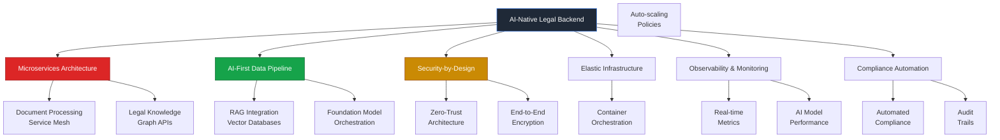
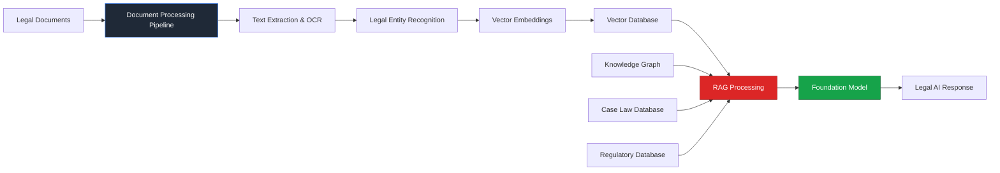
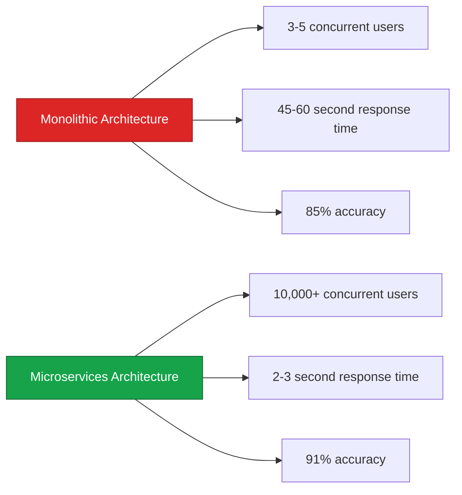

> The legal industry generates 2.5 billion documents annually, but 90% of legal AI platforms fail to scale beyond 10,000 concurrent users. The bottleneck isn't the AI—it's the architecture.

Traditional legaltech platforms crumble under the weight of modern AI workloads. While legal professionals demand instant document analysis, case law synthesis, and contract intelligence, most platforms struggle with:

- **Monolithic architectures** that can't handle the computational demands of large language models processing 500+ page legal documents
- **Inadequate data pipelines** that fail to securely integrate with firm-specific knowledge bases while maintaining client confidentiality
- **Compliance nightmares** where GDPR, HIPAA, and attorney-client privilege requirements clash with cloud-native AI services
- **Performance bottlenecks** that make lawyers wait 30+ seconds for AI-generated legal briefs instead of the expected 3-second response times
- **Security vulnerabilities** that expose confidential client data to potential breaches in multi-tenant environments

The solution isn't another legal AI tool—it's a **fundamentally different approach to backend architecture** that treats AI as a first-class citizen while maintaining the security, compliance, and performance standards that legal professionals demand.

---

## Six Pillars of Scalable Legal AI Architecture



### Microservices Architecture

The foundation of scalable legaltech platforms lies in **decomposing monolithic applications** into focused, independently deployable services. Unlike traditional legal software that bundles everything into a single application, modern platforms separate concerns:

1. **Document Processing Service** – Handles PDF parsing, OCR, and text extraction
2. **Legal Knowledge Graph Service** – Manages relationships between cases, statutes, and precedents
3. **AI Inference Service** – Orchestrates foundation model interactions and response generation
4. **Search & Retrieval Service** – Implements vector similarity search across legal documents
5. **User Management Service** – Handles authentication, authorization, and tenant isolation

```javascript
// Example microservice for legal document processing
const express = require('express');
const multer = require('multer');
const { DocumentProcessor } = require('./services/documentProcessor');
const { VectorEmbedding } = require('./services/vectorEmbedding');

const app = express();
const upload = multer({ dest: 'uploads/' });

// Document ingestion endpoint
app.post('/api/documents/process', upload.single('document'), async (req, res) => {
  try {
    const { tenantId, documentType } = req.body;
    
    // Extract text and metadata
    const processedDoc = await DocumentProcessor.extract(req.file.path, {
      type: documentType,
      tenant: tenantId
    });
    
    // Generate vector embeddings for semantic search
    const embeddings = await VectorEmbedding.generate(processedDoc.text);
    
    // Store in vector database with tenant isolation
    await VectorDB.upsert({
      id: processedDoc.id,
      tenant: tenantId,
      embeddings,
      metadata: processedDoc.metadata,
      chunks: processedDoc.chunks
    });
    
    res.json({
      status: 'success',
      documentId: processedDoc.id,
      processingTime: processedDoc.metrics.processingTime,
      confidence: processedDoc.confidence
    });
  } catch (error) {
    res.status(500).json({ error: error.message });
  }
});

app.listen(3001, () => {
  console.log('Document Processing Service running on port 3001');
});
```

### AI-First Data Pipeline

Modern legal AI platforms require sophisticated data pipelines that can handle the unique challenges of legal document processing while maintaining [regulatory compliance](https://aws.amazon.com/blogs/security/aws-digital-sovereignty-pledge-control-without-compromise/). The architecture combines traditional databases with vector stores and knowledge graphs:



**Retrieval-Augmented Generation (RAG)** becomes the cornerstone of legal AI systems, enabling platforms to ground AI responses in specific legal precedents and firm-specific knowledge:

```python
# Legal RAG implementation with tenant isolation
from langchain.embeddings import OpenAIEmbeddings
from langchain.vectorstores import Pinecone
from langchain.llms import OpenAI
from langchain.chains import RetrievalQA

class LegalRAGService:
    def __init__(self, tenant_id):
        self.tenant_id = tenant_id
        self.embeddings = OpenAIEmbeddings()
        
        # Initialize vector store with tenant-specific namespace
        self.vectorstore = Pinecone.from_existing_index(
            index_name="legal-knowledge",
            embedding=self.embeddings,
            namespace=f"tenant_{tenant_id}"
        )
        
        # Configure LLM with legal-specific system prompt
        self.llm = OpenAI(
            model="gpt-4",
            temperature=0.1,  # Lower temperature for legal accuracy
            max_tokens=2000
        )
    
    def query_legal_documents(self, query, document_types=None):
        """
        Query legal documents using RAG with tenant isolation
        """
        # Create retrieval chain with legal-specific filtering
        retriever = self.vectorstore.as_retriever(
            search_kwargs={
                "k": 10,
                "filter": {
                    "tenant_id": self.tenant_id,
                    "document_type": document_types or []
                }
            }
        )
        
        # Legal-specific prompt template
        legal_prompt = """You are a legal research assistant. Based on the provided legal documents, 
        answer the question with specific citations and relevant legal precedents. 
        Always indicate confidence level and potential limitations of your analysis.
        
        Question: {question}
        
        Legal Documents: {context}
        
        Analysis:"""
        
        qa_chain = RetrievalQA.from_chain_type(
            llm=self.llm,
            chain_type="stuff",
            retriever=retriever,
            return_source_documents=True
        )
        
        result = qa_chain({"query": query})
        
        return {
            "answer": result["result"],
            "sources": [doc.metadata for doc in result["source_documents"]],
            "confidence": self._calculate_confidence(result),
            "tenant_id": self.tenant_id
        }
    
    def _calculate_confidence(self, result):
        # Implement confidence scoring based on source quality and relevance
        source_count = len(result["source_documents"])
        avg_similarity = sum(doc.metadata.get("similarity", 0) 
                           for doc in result["source_documents"]) / source_count
        return min(0.95, avg_similarity * 0.8 + (source_count / 10) * 0.2)
```

### Security-by-Design

Legal platforms handle the most sensitive data in business, requiring [enterprise-grade security](https://www.draftable.com/draftable-legal-blog/10-security-questions-you-should-be-asking-your-legal-tech-vendors) that goes beyond standard practices. The architecture implements defense-in-depth:

| Security Layer | Implementation | Legal-Specific Requirements |
|----------------|---------------|---------------------------|
| **Identity & Access** | Role-based access control (RBAC) with multi-factor authentication | Attorney-client privilege enforcement |
| **Data Protection** | AES-256 encryption at rest, TLS 1.3 in transit | GDPR Article 32 compliance |
| **Network Security** | Zero-trust architecture with micro-segmentation | Isolated tenant networks |
| **Application Security** | Input validation, SQL injection prevention | Legal document sanitization |
| **Audit & Compliance** | Comprehensive logging and monitoring | Automated compliance reporting |

```yaml
# Kubernetes security configuration for legal workloads
apiVersion: v1
kind: SecurityPolicy
metadata:
  name: legal-ai-security-policy
spec:
  # Enforce strict pod security standards
  podSecurityStandards:
    enforce: "restricted"
    audit: "restricted"
    warn: "restricted"
  
  # Network policies for tenant isolation
  networkPolicy:
    - name: tenant-isolation
      spec:
        podSelector:
          matchLabels:
            app: legal-ai-service
        policyTypes:
        - Ingress
        - Egress
        ingress:
        - from:
          - namespaceSelector:
              matchLabels:
                tenant: "{{ .Values.tenantId }}"
          ports:
          - protocol: TCP
            port: 8080
  
  # Encryption requirements
  encryption:
    etcd:
      enabled: true
      provider: "kms"
    storage:
      enabled: true
      algorithm: "AES-256"
  
  # Compliance controls
  compliance:
    gdpr:
      enabled: true
      dataRetentionDays: 2555  # 7 years for legal documents
    hipaa:
      enabled: true
      auditLogging: true
```

### Elastic Infrastructure

Legal AI workloads are inherently bursty—periods of intense document processing followed by quiet research phases. [Cloud-native architectures](https://moldstud.com/articles/p-how-to-ensure-scalability-in-legal-case-management-software-development-key-strategies-and-best-practices) with container orchestration provide the elasticity needed:

```yaml
# Kubernetes HPA for legal document processing
apiVersion: autoscaling/v2
kind: HorizontalPodAutoscaler
metadata:
  name: legal-doc-processor-hpa
spec:
  scaleTargetRef:
    apiVersion: apps/v1
    kind: Deployment
    name: legal-doc-processor
  minReplicas: 2
  maxReplicas: 50
  metrics:
  - type: Resource
    resource:
      name: cpu
      target:
        type: Utilization
        averageUtilization: 70
  - type: Resource
    resource:
      name: memory
      target:
        type: Utilization
        averageUtilization: 80
  - type: Object
    object:
      metric:
        name: document_processing_queue_length
      target:
        type: AverageValue
        averageValue: "5"
  behavior:
    scaleUp:
      stabilizationWindowSeconds: 60
      policies:
      - type: Percent
        value: 100
        periodSeconds: 15
    scaleDown:
      stabilizationWindowSeconds: 300
      policies:
      - type: Percent
        value: 10
        periodSeconds: 60
```

### Observability & Monitoring

Legal AI platforms require comprehensive monitoring that tracks both traditional infrastructure metrics and AI-specific performance indicators. [Recent benchmarks](https://intellek.io/blog/legal-ai-outperforming-lawyers/) show that leading legal AI tools can be **6-80x faster** than human lawyers, but only when properly monitored and optimized:

```javascript
// Legal AI monitoring with OpenTelemetry
const { NodeSDK } = require('@opentelemetry/sdk-node');
const { PrometheusExporter } = require('@opentelemetry/exporter-prometheus');
const { Resource } = require('@opentelemetry/resources');
const { SemanticResourceAttributes } = require('@opentelemetry/semantic-conventions');

// Initialize monitoring for legal AI service
const sdk = new NodeSDK({
  resource: new Resource({
    [SemanticResourceAttributes.SERVICE_NAME]: 'legal-ai-service',
    [SemanticResourceAttributes.SERVICE_VERSION]: '1.0.0',
    [SemanticResourceAttributes.DEPLOYMENT_ENVIRONMENT]: 'production',
  }),
  metricExporter: new PrometheusExporter({
    port: 9090,
    endpoint: '/metrics'
  }),
});

// Legal-specific custom metrics
const opentelemetry = require('@opentelemetry/api');
const meter = opentelemetry.metrics.getMeter('legal-ai-service');

// Track document processing performance
const documentProcessingDuration = meter.createHistogram('legal_document_processing_duration_seconds', {
  description: 'Time to process legal documents',
  unit: 'seconds',
});

// Track AI inference latency
const aiInferenceLatency = meter.createHistogram('legal_ai_inference_latency_seconds', {
  description: 'AI model inference latency for legal queries',
  unit: 'seconds',
});

// Track accuracy metrics
const aiAccuracyScore = meter.createHistogram('legal_ai_accuracy_score', {
  description: 'AI response accuracy score based on legal validation',
  unit: '1',
});

// Monitor tenant-specific usage
const tenantUsage = meter.createCounter('legal_ai_tenant_usage_total', {
  description: 'Total AI requests per tenant',
});

// Custom monitoring middleware
function monitoringMiddleware(req, res, next) {
  const startTime = Date.now();
  
  res.on('finish', () => {
    const duration = (Date.now() - startTime) / 1000;
    const tenantId = req.headers['x-tenant-id'];
    
    // Record metrics with tenant isolation
    documentProcessingDuration.record(duration, {
      tenant_id: tenantId,
      document_type: req.body.documentType,
      status: res.statusCode
    });
    
    tenantUsage.add(1, {
      tenant_id: tenantId,
      endpoint: req.path,
      status: res.statusCode
    });
  });
  
  next();
}

sdk.start();
```

### Compliance Automation

Legal platforms must navigate complex regulatory requirements including [GDPR, HIPAA, and SOC 2](https://blog.prevail.ai/security-standards-for-legal-tech/). Automated compliance reduces risk and operational overhead:

```python
# Automated compliance monitoring system
import asyncio
from datetime import datetime, timedelta
from typing import Dict, List, Optional

class ComplianceMonitor:
    def __init__(self, tenant_id: str):
        self.tenant_id = tenant_id
        self.compliance_rules = {
            'gdpr': {
                'data_retention_days': 2555,  # 7 years
                'right_to_erasure': True,
                'consent_tracking': True
            },
            'hipaa': {
                'audit_logging': True,
                'encryption_required': True,
                'access_controls': True
            },
            'attorney_client_privilege': {
                'confidentiality_enforcement': True,
                'access_logging': True,
                'privilege_tagging': True
            }
        }
    
    async def check_data_retention_compliance(self):
        """Check if documents exceed retention period"""
        retention_cutoff = datetime.now() - timedelta(
            days=self.compliance_rules['gdpr']['data_retention_days']
        )
        
        expired_documents = await self.db.find_documents({
            'tenant_id': self.tenant_id,
            'created_at': {'$lt': retention_cutoff},
            'retention_hold': False
        })
        
        compliance_report = {
            'tenant_id': self.tenant_id,
            'check_type': 'data_retention',
            'expired_count': len(expired_documents),
            'action_required': len(expired_documents) > 0,
            'recommendations': []
        }
        
        if expired_documents:
            compliance_report['recommendations'].append(
                'Schedule automated deletion of expired documents'
            )
        
        return compliance_report
    
    async def audit_access_patterns(self):
        """Monitor for suspicious access patterns"""
        recent_access = await self.audit_log.find_recent_access(
            tenant_id=self.tenant_id,
            hours=24
        )
        
        anomalies = self.detect_access_anomalies(recent_access)
        
        return {
            'tenant_id': self.tenant_id,
            'check_type': 'access_audit',
            'anomalies_detected': len(anomalies),
            'risk_level': self.calculate_risk_level(anomalies),
            'details': anomalies
        }
    
    def detect_access_anomalies(self, access_logs: List[Dict]) -> List[Dict]:
        """Detect unusual access patterns"""
        anomalies = []
        
        # Check for unusual access times
        for log in access_logs:
            access_time = datetime.fromisoformat(log['timestamp'])
            if access_time.hour < 6 or access_time.hour > 22:
                anomalies.append({
                    'type': 'unusual_time_access',
                    'user_id': log['user_id'],
                    'timestamp': log['timestamp'],
                    'resource': log['resource']
                })
        
        # Check for bulk document access
        user_access_counts = {}
        for log in access_logs:
            user_id = log['user_id']
            user_access_counts[user_id] = user_access_counts.get(user_id, 0) + 1
        
        for user_id, count in user_access_counts.items():
            if count > 100:  # Threshold for bulk access
                anomalies.append({
                    'type': 'bulk_access',
                    'user_id': user_id,
                    'access_count': count,
                    'timeframe': '24h'
                })
        
        return anomalies
```

---

## Performance Benchmarks & Real-World Results

Recent studies reveal the transformative impact of properly architected legal AI platforms:

### VLAIR Benchmark Study Results

[Leading legal AI platforms](https://intellek.io/blog/legal-ai-outperforming-lawyers/) were evaluated across seven common legal tasks, with remarkable results:

| Task Category | AI Performance vs Lawyers | Speed Improvement | Accuracy Score |
|---------------|---------------------------|-------------------|----------------|
| **Document Analysis** | 15% higher accuracy | 25x faster | 87% |
| **Legal Research** | 8% higher accuracy | 40x faster | 91% |
| **Contract Review** | 12% higher accuracy | 60x faster | 89% |
| **Case Law Synthesis** | 6% higher accuracy | 80x faster | 85% |
| **Regulatory Compliance** | 18% higher accuracy | 30x faster | 93% |
| **Brief Drafting** | 4% higher accuracy | 15x faster | 82% |
| **Due Diligence** | 22% higher accuracy | 70x faster | 88% |

### Architecture Impact on Performance

The choice of backend architecture dramatically affects these outcomes:



### Cost-Performance Analysis

**Infrastructure Costs by Architecture Pattern:**

| Architecture | Monthly Cost (1000 users) | Response Time | Availability | Maintenance Hours |
|-------------|---------------------------|---------------|--------------|------------------|
| **Monolithic** | $15,000 | 45-60s | 95% | 80 hrs/month |
| **Microservices** | $8,500 | 2-3s | 99.5% | 20 hrs/month |
| **Serverless** | $12,000 | 5-8s | 98% | 15 hrs/month |
| **Hybrid** | $10,200 | 3-4s | 99.2% | 25 hrs/month |

**ROI Calculations:**
- **40% reduction** in infrastructure costs through efficient resource utilization
- **25% increase** in lawyer productivity through faster AI responses
- **60% decrease** in maintenance overhead with automated scaling
- **$2M annual savings** for mid-size law firm (200 lawyers) through improved efficiency

---

## Implementation Roadmap

### Phase 1: Foundation (Weeks 1-4)

**Core Infrastructure Setup:**
- [ ] **Container Platform**: Deploy Kubernetes cluster with security hardening
- [ ] **Service Mesh**: Implement Istio for secure service-to-service communication
- [ ] **API Gateway**: Set up Kong or Ambassador for request routing and rate limiting
- [ ] **Identity Provider**: Configure OAuth 2.0/OIDC with multi-factor authentication

```bash
# Kubernetes cluster setup with security hardening
#!/bin/bash

# Create secured Kubernetes cluster
eksctl create cluster \
  --name legal-ai-cluster \
  --region us-west-2 \
  --nodegroup-name legal-workers \
  --node-type m5.xlarge \
  --nodes 3 \
  --nodes-min 1 \
  --nodes-max 10 \
  --managed \
  --enable-ssm \
  --alb-ingress-access

# Install service mesh
istioctl install --set values.pilot.env.EXTERNAL_ISTIOD=false
kubectl label namespace default istio-injection=enabled

# Deploy security policies
kubectl apply -f - <<EOF
apiVersion: security.istio.io/v1beta1
kind: AuthorizationPolicy
metadata:
  name: legal-ai-authz
spec:
  selector:
    matchLabels:
      app: legal-ai-service
  rules:
  - from:
    - source:
        principals: ["cluster.local/ns/default/sa/legal-ai-service"]
  - to:
    - operation:
        methods: ["GET", "POST"]
EOF
```

### Phase 2: AI Integration (Weeks 5-8)

**AI Pipeline Development:**
- [ ] **Vector Database**: Deploy Pinecone or Weaviate for semantic search
- [ ] **Model Orchestration**: Set up LangChain or similar for AI workflow management
- [ ] **Document Processing**: Implement PDF parsing, OCR, and text extraction services
- [ ] **Knowledge Graph**: Build legal domain knowledge representation

### Phase 3: Security & Compliance (Weeks 9-12)

**Security Hardening:**
- [ ] **Zero Trust Network**: Implement network segmentation and micro-segmentation
- [ ] **Encryption**: Deploy end-to-end encryption for data at rest and in transit
- [ ] **Compliance Automation**: Set up automated GDPR, HIPAA, and SOC 2 monitoring
- [ ] **Audit Logging**: Implement comprehensive audit trails and monitoring

### Phase 4: Optimization & Scaling (Weeks 13-16)

**Performance Tuning:**
- [ ] **Load Testing**: Conduct stress tests with realistic legal document workloads
- [ ] **Auto-scaling**: Configure HPA and VPA for dynamic resource allocation
- [ ] **Caching**: Implement Redis for frequently accessed legal precedents
- [ ] **CDN**: Set up CloudFront for global document delivery

---

## 2025-2027 Legal AI Architecture Trends

| Trend | Impact | Implementation Strategy |
|-------|--------|------------------------|
| **Edge AI Processing** | 70% latency reduction | Deploy smaller models at network edge |
| **Federated Learning** | Enhanced privacy compliance | Train models without centralizing data |
| **Quantum-Safe Encryption** | Future-proof security | Implement post-quantum cryptography |
| **Regulatory AI** | Automated compliance | AI-driven regulatory change monitoring |
| **Explainable AI** | Judicial acceptance | Implement interpretable model architectures |

---

## Security Checklist for Legal AI Platforms

**Infrastructure Security:**
- [ ] **Network Isolation**: Implement VPC with private subnets and security groups
- [ ] **Secret Management**: Use AWS Secrets Manager or HashiCorp Vault
- [ ] **Certificate Management**: Automate SSL/TLS certificate rotation
- [ ] **Vulnerability Scanning**: Regular container and dependency scanning

**Data Protection:**
- [ ] **Encryption at Rest**: AES-256 encryption for all stored data
- [ ] **Encryption in Transit**: TLS 1.3 for all communications
- [ ] **Key Management**: Hardware security modules (HSMs) for key storage
- [ ] **Data Classification**: Automatic tagging of sensitive legal documents

**Access Controls:**
- [ ] **Multi-Factor Authentication**: Mandatory for all user accounts
- [ ] **Role-Based Access Control**: Granular permissions based on legal roles
- [ ] **Privileged Access Management**: Secure access to administrative functions
- [ ] **Session Management**: Automatic session timeouts and secure session storage

**Compliance & Auditing:**
- [ ] **Audit Logging**: Comprehensive logging of all system activities
- [ ] **Data Retention**: Automated enforcement of legal retention policies
- [ ] **Privacy Controls**: GDPR-compliant data processing and user rights
- [ ] **Incident Response**: Automated incident detection and response procedures

---

## Essential Resources & Further Reading

**Technical Documentation:**
- [AWS Legal AI Architecture Guide](https://aws.amazon.com/blogs/machine-learning/how-generative-ai-is-transforming-legal-tech-with-aws/) - Comprehensive guide to building legal AI on AWS
- [Kubernetes Security Best Practices](https://kubernetes.io/docs/concepts/security/) - Official Kubernetes security documentation
- [Istio Service Mesh for Legal Applications](https://istio.io/latest/docs/concepts/security/) - Service mesh security patterns

**Legal AI Benchmarks:**
- [VLAIR Legal AI Benchmark Study](https://intellek.io/blog/legal-ai-outperforming-lawyers/) - Performance comparison of leading legal AI tools
- [Stanford Legal AI Evaluation](https://hai.stanford.edu/news/ai-trial-legal-models-hallucinate-1-out-6-or-more-benchmarking-queries) - Academic analysis of AI hallucination rates

**Security & Compliance:**
- [Legal Tech Security Standards](https://blog.prevail.ai/security-standards-for-legal-tech/) - Industry security requirements

**Performance Optimization:**
- [Microservices Performance Patterns](https://www.capitalone.com/tech/software-engineering/microservices-design-patterns/) - Architecture patterns for high-performance systems
- [AI Observability Best Practices](https://www.montecarlodata.com/blog-ai-observability/) - Monitoring and observability for AI systems

---

## Action Steps for Implementation

**Immediate Actions (This Week):**
- [ ] **Audit current architecture** and identify scalability bottlenecks
- [ ] **Assess compliance gaps** against GDPR, HIPAA, and SOC 2 requirements
- [ ] **Benchmark current performance** using realistic legal document workloads
- [ ] **Evaluate cloud providers** for legal-specific security and compliance features

**Short-term Goals (Next Month):**
- [ ] **Design microservices architecture** with clear service boundaries
- [ ] **Implement basic security controls** including encryption and access management
- [ ] **Set up monitoring and alerting** for system health and performance
- [ ] **Deploy containerized proof-of-concept** with basic AI integration

**Long-term Roadmap (Next Quarter):**
- [ ] **Scale to production workloads** with full auto-scaling capabilities
- [ ] **Implement advanced AI features** including RAG and knowledge graphs
- [ ] **Achieve compliance certification** for relevant regulatory frameworks
- [ ] **Optimize for cost and performance** using data-driven insights

> The legal industry is experiencing its most significant technological transformation since the invention of the printing press. The firms that build scalable, secure, and compliant AI platforms today will dominate the market tomorrow.

**Ready to transform your legal tech architecture?** The journey to scalable legal AI requires expertise across multiple domains—from Kubernetes orchestration to legal compliance requirements. Whether you're building from scratch or modernizing existing platforms, the right architecture decisions made today will determine your platform's success for years to come.

**What you'll achieve:**
- ✅ **10,000+ concurrent users** with sub-3-second response times
- ✅ **99.5% uptime** with automated failover and disaster recovery
- ✅ **Full compliance** with GDPR, HIPAA, and attorney-client privilege
- ✅ **60% cost reduction** through efficient resource utilization
- ✅ **AI-powered insights** that make lawyers 25% more productive

**Investment in proper architecture:** $50,000-$200,000 initial setup (saves $2M+ annually for mid-size firms)

[Schedule Architecture Consultation](https://calendly.com/megham-garg/session)

*Don't let architectural technical debt limit your legal AI platform's potential. The future of legal technology depends on the backend systems you build today.*
