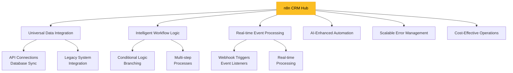
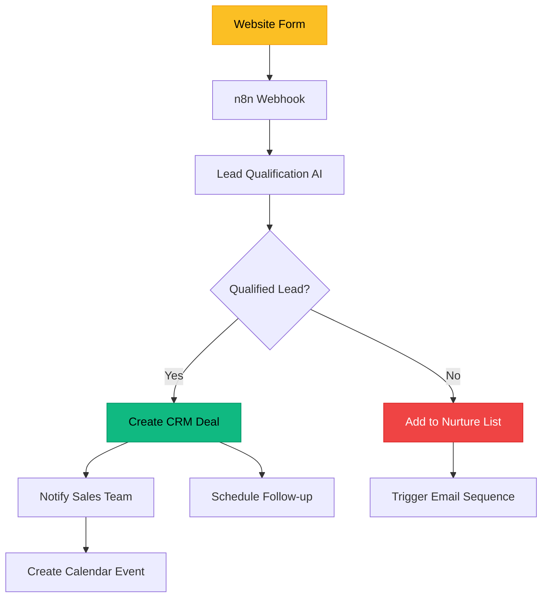
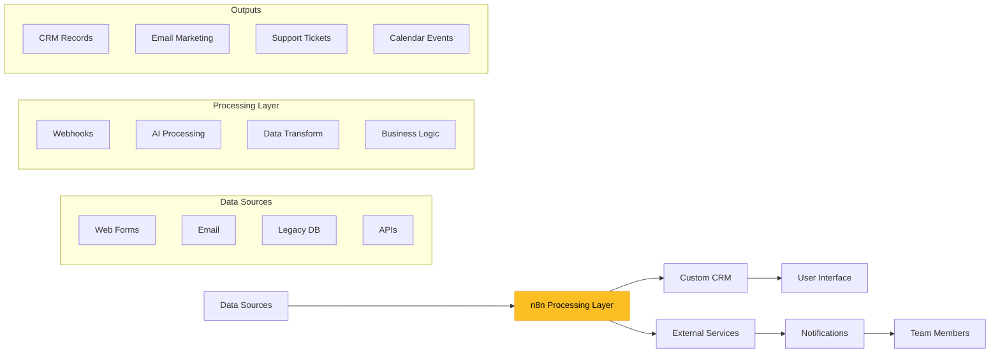
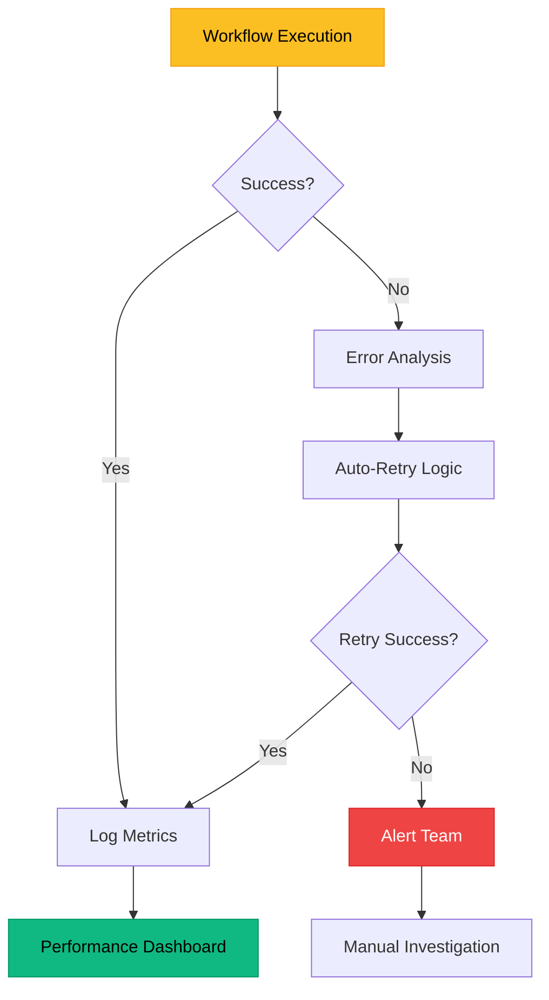

## Why Custom CRM Automation Is Still Broken

> The best CRM is the one your team actually uses—but only if it works exactly how your business does.

Custom CRMs promise flexibility and perfect alignment with your unique processes, but they often become **expensive maintenance nightmares**. Most businesses struggle with:

- **Rigid native automation** that can't handle complex multi-step processes or conditional logic
- **Siloed data** trapped in spreadsheets, legacy systems, and third-party tools that don't play nice together
- **Manual workarounds** that eat up hours of productive time and introduce human error
- **Limited integrations** that force you to choose between your perfect CRM and your essential tools
- **Scalability walls** where adding complexity means exponential costs and development time

The solution isn't another CRM platform—it's [n8n](https://n8n.io/), the open-source workflow automation platform that transforms any custom CRM into a hyperconnected, intelligent automation powerhouse.

---

## Six Pillars of n8n-Powered CRM Transformation



### Universal Data Integration

Unlike traditional CRM platforms that limit you to their marketplace, n8n connects to **literally anything** with an API. This includes:

1. **400+ Native Integrations** – [HubSpot](https://n8n.io/integrations/hubspot/), [Salesforce](https://n8n.io/integrations/salesforce/), [Pipedrive](https://n8n.io/integrations/pipedrive/), and hundreds more
2. **Custom API Connections** – Connect to proprietary systems, legacy databases, and specialized tools
3. **Database Direct Access** – MySQL, PostgreSQL, MongoDB, and other databases for real-time data synchronization

```javascript
// Example: Sync customer data from legacy MySQL to modern CRM
{
  "nodes": [
    {
      "name": "MySQL Legacy Database",
      "type": "n8n-nodes-base.mySql",
      "parameters": {
        "operation": "select",
        "query": "SELECT * FROM customers WHERE updated_at > NOW() - INTERVAL 1 HOUR"
      }
    },
    {
      "name": "Transform Data",
      "type": "n8n-nodes-base.function",
      "parameters": {
        "functionCode": "items.map(item => ({
          email: item.email,
          name: `${item.first_name} ${item.last_name}`,
          phone: item.phone_number,
          company: item.company_name,
          lead_source: 'legacy_import'
        }))"
      }
    },
    {
      "name": "Update CRM",
      "type": "n8n-nodes-base.hubspot",
      "parameters": {
        "resource": "contact",
        "operation": "upsert"
      }
    }
  ]
}
```

### Intelligent Workflow Logic

n8n's visual workflow builder enables complex business logic that traditional CRM automation simply can't handle:

- **Conditional Branching** – Different paths based on lead source, deal size, or customer behavior
- **Loop Processing** – Handle bulk operations and data transformations efficiently
- **Error Handling** – Robust retry mechanisms and fallback processes
- **Data Transformation** – Clean, enrich, and standardize data before it hits your CRM

> _Transform raw leads into qualified prospects automatically, with different nurturing sequences based on dozens of criteria traditional CRMs can't process._

### Real-time Event Processing

The magic happens when your CRM becomes reactive to real-world events:



**Webhook triggers** make your CRM instantly responsive to:
- Form submissions on your website
- Payment processing events
- Support ticket creation
- Email engagement tracking
- Social media interactions

### AI-Enhanced Automation

n8n's [AI capabilities](https://n8n.io/ai/) turn your CRM into an intelligent system that learns and adapts:

```javascript
// AI-powered lead qualification example
{
  "name": "Qualify Lead with AI",
  "type": "n8n-nodes-base.openAi",
  "parameters": {
    "model": "gpt-4",
    "messages": [
      {
        "role": "system",
        "content": "You are a lead qualification expert. Analyze the following lead data and return a JSON object with qualification_score (1-10), reasoning, and recommended_action."
      },
      {
        "role": "user", 
        "content": "Company: {{$node['Webhook'].json['company']}}\nIndustry: {{$node['Webhook'].json['industry']}}\nEmployees: {{$node['Webhook'].json['employees']}}\nBudget: {{$node['Webhook'].json['budget']}}"
      }
    ]
  }
}
```

### Scalable Error Management

Enterprise-grade reliability through [centralized error handling](https://n8n.io/workflows/4519-centralized-n8n-error-management-system-with-automated-email-alerts-via-gmail/):

| Error Type | Automated Response | Notification Channel |
|------------|-------------------|---------------------|
| API Rate Limit | Automatic retry with exponential backoff | Slack alert |
| Data Validation | Quarantine record + manual review trigger | Email + CRM task |
| Integration Down | Switch to backup workflow | PagerDuty alert |
| Webhook Timeout | Retry queue + fallback processing | Dashboard notification |

### Cost-Effective Operations

n8n's unique **execution-based pricing** model means:
- **No per-operation charges** – Complex multi-step workflows cost the same as simple ones
- **Predictable scaling** – [Pricing](https://n8n.io/pricing/) starts at $24/month for unlimited workflow complexity
- **Self-hosting option** – Complete control and zero usage fees for technical teams

---

## Implementation Architecture



This architecture enables **loose coupling** between your CRM and other systems while maintaining **tight integration** through n8n's orchestration layer.

---

## Practical Implementation Guide

### Phase 1: Foundation Setup

**Prerequisites:**
- n8n account ([Cloud](https://app.n8n.cloud/register) or [self-hosted](https://docs.n8n.io/hosting/))
- API access to your custom CRM
- Integration credentials for key services

**Essential First Workflows:**

1. **Lead Capture & Qualification** ([Template](https://n8n.io/workflows/categories/crm/))
2. **Customer Onboarding Automation** 
3. **Deal Pipeline Management**
4. **Communication Sync** (Email, Slack, SMS)

### Phase 2: Advanced Automation

```javascript
// Multi-channel lead nurturing workflow
{
  "name": "Advanced Lead Nurturing",
  "nodes": [
    {
      "name": "New Lead Trigger",
      "type": "n8n-nodes-base.webhook"
    },
    {
      "name": "Enrich Lead Data",
      "type": "n8n-nodes-base.httpRequest",
      "parameters": {
        "url": "https://api.clearbit.com/v2/people/find",
        "method": "GET"
      }
    },
    {
      "name": "Score Lead Quality",
      "type": "n8n-nodes-base.openAi",
      "parameters": {
        "model": "gpt-4",
        "messages": [
          {
            "role": "system",
            "content": "Score this lead from 1-100 based on company size, industry fit, and engagement level. Return JSON with score and reasoning."
          }
        ]
      }
    },
    {
      "name": "Route by Score",
      "type": "n8n-nodes-base.if",
      "parameters": {
        "conditions": {
          "number": [
            {
              "value1": "={{$node['Score Lead Quality'].json.score}}",
              "operation": "larger",
              "value2": 70
            }
          ]
        }
      }
    },
    {
      "name": "High-Value Lead Path",
      "type": "n8n-nodes-base.merge",
      "parameters": {
        "mode": "passThrough"
      }
    },
    {
      "name": "Standard Lead Path",
      "type": "n8n-nodes-base.merge",
      "parameters": {
        "mode": "passThrough"
      }
    }
  ]
}
```

### Phase 3: Monitoring & Optimization

Deploy [comprehensive monitoring](https://docs.n8n.io/flow-logic/error-handling/) across all workflows:



**Key Metrics to Track:**
- Workflow execution success rate
- Average processing time
- Data quality scores
- Integration uptime
- Cost per lead processed

---

## Real-World Success Stories

### Case Study 1: Manufacturing B2B CRM

**Challenge:** Legacy ERP system with 10,000+ customer records needed real-time sync with modern CRM, plus automated quote generation.

**Solution:** n8n workflow monitoring ERP database changes, triggering immediate CRM updates and PDF quote generation via [AI-powered templates](https://n8n.io/workflows/5336-activecampaign-tool-mcp-server-all-48-operations/).

**Results:**
- **95% reduction** in manual data entry
- **3x faster** quote turnaround time
- **$50K annual savings** in operational costs

### Case Study 2: SaaS Customer Success Automation

**Challenge:** Custom CRM needed to track user behavior across multiple touchpoints and trigger personalized outreach.

**Solution:** Multi-trigger workflow combining:
- Product usage webhooks
- Email engagement tracking
- Support ticket analysis
- Health score calculation

**Results:**
- **40% increase** in customer retention
- **60% faster** response to at-risk customers
- **Automated 80%** of routine follow-ups

---

## Advanced Patterns & Best Practices

### Data Transformation Patterns

```javascript
// Standardize incoming data from multiple sources
const standardizeContact = (rawData, source) => {
  const mapping = {
    'webform': {
      email: 'email_address',
      name: 'full_name',
      company: 'company_name'
    },
    'linkedin': {
      email: 'emailAddress',
      name: 'formattedName',
      company: 'positions.values[0].company.name'
    },
    'salesforce': {
      email: 'Email',
      name: 'Name',
      company: 'Account.Name'
    }
  };
  
  return {
    email: getValue(rawData, mapping[source].email),
    name: getValue(rawData, mapping[source].name),
    company: getValue(rawData, mapping[source].company),
    source: source,
    created_at: new Date().toISOString()
  };
};
```

### Performance Optimization

| Optimization | Implementation | Impact |
|--------------|---------------|--------|
| **Batch Processing** | Group similar operations | 70% faster execution |
| **Caching Strategy** | Store frequently accessed data | 50% reduced API calls |
| **Parallel Execution** | Process independent tasks simultaneously | 60% time savings |
| **Queue Management** | Handle high-volume triggers | 99.9% uptime |

### Security Best Practices

```javascript
// Secure credential management
{
  "name": "Secure API Call",
  "type": "n8n-nodes-base.httpRequest",
  "parameters": {
    "url": "https://api.yourcrm.com/contacts",
    "authentication": "predefinedCredentialType",
    "nodeCredentialType": "yourCrmApi",
    "headers": {
      "User-Agent": "n8n-automation/1.0"
    }
  }
}
```

**Security Checklist:**
- [ ] Store all credentials in n8n's encrypted credential system
- [ ] Use environment variables for sensitive configuration
- [ ] Implement proper data validation and sanitization
- [ ] Enable audit logging for all CRM operations
- [ ] Regular security updates and monitoring

---

## 2025-2027 CRM Automation Trends

| Trend | n8n Advantage | Business Impact |
|-------|---------------|----------------|
| **AI-First Workflows** | Native OpenAI, Anthropic integrations | 80% reduction in manual qualification |
| **Real-time Customer Journey** | Event-driven architecture | 3x faster response times |
| **Predictive Analytics** | ML model integration via Python | 40% better lead scoring accuracy |
| **Omnichannel Orchestration** | 400+ platform integrations | Unified customer experience |
| **Privacy-First Automation** | Self-hosting + GDPR compliance | Future-proof data governance |

---

## Essential Video Resources

**n8n CRM Automation Fundamentals:**
- [CRM Automation Guide & Templates](https://youtu.be/lK3veuZAg0c) - Complete beginner walkthrough
- [Advanced n8n Workflows](https://youtu.be/bTF3tACqPRU) - Error handling and production best practices
- [AI-Powered CRM Automation](https://youtu.be/XEUVl3bbMhI) - Integrating AI into your workflows

**Real-World Implementations:**
- [Scaling n8n for Enterprise](https://youtu.be/1jvxxa7tdjw) - Production deployment strategies
- [Custom CRM Integration Case Studies](https://youtu.be/rKfknA48FGk) - Multiple industry examples

---

## Your 30-Day Implementation Roadmap

### Week 1: Foundation
- [ ] Set up n8n instance ([Cloud](https://app.n8n.cloud/register) or [self-hosted](https://docs.n8n.io/hosting/))
- [ ] Connect primary CRM via API
- [ ] Create first webhook trigger
- [ ] Deploy basic lead capture workflow

### Week 2: Integration
- [ ] Connect email systems (Gmail, Outlook)
- [ ] Set up database synchronization
- [ ] Implement data transformation workflows
- [ ] Add error handling and notifications

### Week 3: Intelligence
- [ ] Integrate AI for lead qualification
- [ ] Set up automated nurturing sequences
- [ ] Deploy customer onboarding automation
- [ ] Create performance dashboards

### Week 4: Optimization
- [ ] Monitor workflow performance
- [ ] Optimize for scale and speed
- [ ] Train team on workflow management
- [ ] Plan next phase expansions

---

## Template Library Quick-Start

Ready-to-deploy n8n workflows for immediate value:

| Template | Use Case | Complexity | Setup Time |
|----------|----------|------------|------------|
| [Lead Qualification](https://n8n.io/workflows/categories/crm/) | Score incoming leads with AI | ⭐⭐⭐ | 30 min |
| [Customer Onboarding](https://n8n.io/workflows/4508-multi-platform-ai-sales-agent-with-rag-crm-calendar-and-stripe/) | Automated welcome sequences | ⭐⭐⭐⭐ | 45 min |
| [Deal Pipeline Automation](https://n8n.io/workflows/categories/sales/) | Move deals based on actions | ⭐⭐⭐⭐⭐ | 60 min |
| [Support Ticket Integration](https://n8n.io/workflows/5509-ai-powered-contact-management-in-airtable-with-natural-language-commands/) | Sync support with CRM | ⭐⭐⭐ | 20 min |

---

## ROI Calculator

**Input your current metrics:**
- Manual data entry hours/week: ___
- Average hourly cost: $___
- Lead response time: ___ hours
- Data quality issues/month: ___

**Expected improvements with n8n:**
- **90% reduction** in manual data entry
- **75% faster** lead response times
- **95% improvement** in data quality
- **60% increase** in sales team productivity

**Monthly savings estimate:** $5,000 - $50,000+ depending on team size and complexity.

---

## Action Steps Checklist

**Immediate (This Week):**
- [ ] **Audit current CRM pain points** and manual processes
- [ ] **Calculate time spent** on repetitive CRM tasks
- [ ] **Identify top 3 integration needs** (email, forms, databases)
- [ ] **Sign up for n8n trial** and explore templates

**Short-term (Next Month):**
- [ ] **Deploy first automation** using existing templates
- [ ] **Connect primary integrations** (CRM, email, forms)
- [ ] **Set up monitoring** and error handling
- [ ] **Train key team members** on workflow management

**Long-term (Next Quarter):**
- [ ] **Scale successful workflows** across departments
- [ ] **Implement AI-powered** lead qualification
- [ ] **Build advanced reporting** and analytics
- [ ] **Expand to customer success** and marketing automation

> The best time to automate your CRM was yesterday. The second best time is right now.

**Ready to transform your custom CRM?** As a freelance automation consultant, I help businesses like yours implement n8n workflows that deliver results from day one. Whether you need a simple lead capture system or complex multi-system integration, I'll guide you through the entire process.

**What you get:**
- ✅ **Custom workflow design** tailored to your specific CRM needs
- ✅ **Full implementation** with testing and optimization
- ✅ **Team training** to manage workflows independently
- ✅ **30-day support** to ensure everything runs smoothly

**Investment:** Starting at $2,500 for basic automation (saves most clients $5K+ monthly)

[Book Your Free CRM Automation Strategy Call](https://calendly.com/megham-garg/session) | [Explore n8n Templates](https://n8n.io/workflows/categories/crm/) | [Join n8n Community](https://community.n8n.io/)

*Don't let manual processes kill your productivity. Book a call today and let's automate your CRM the right way.*
