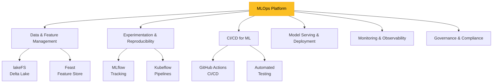
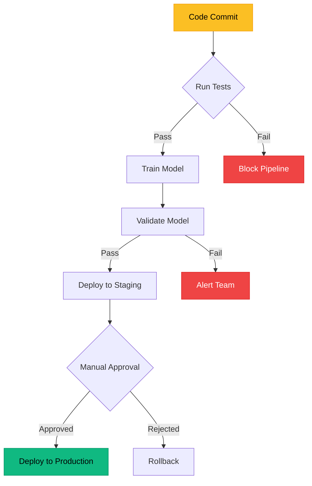
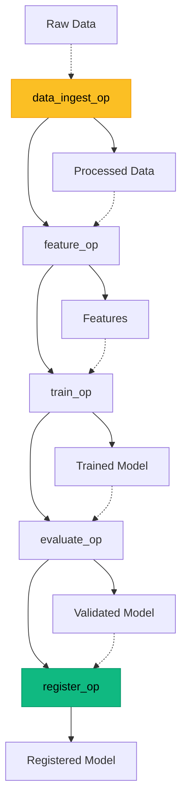
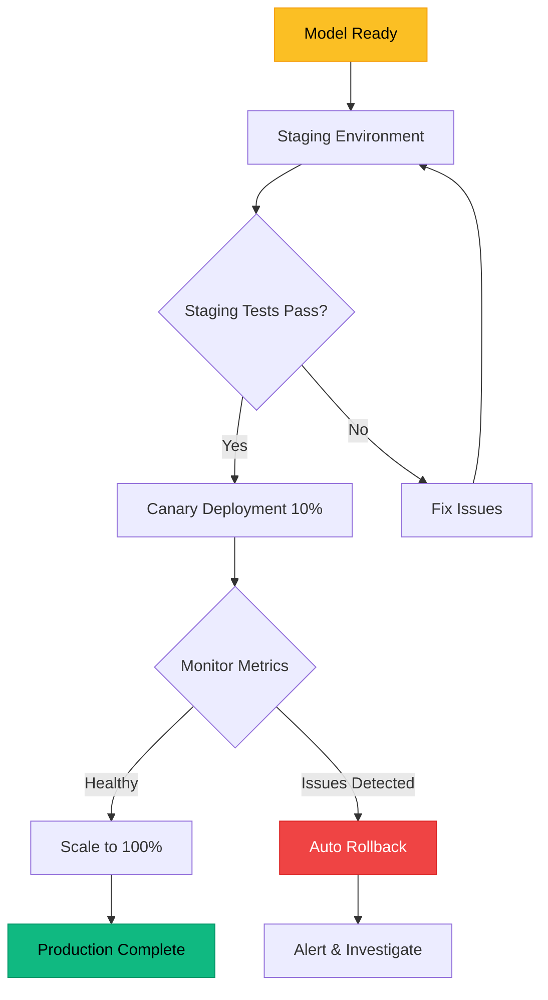
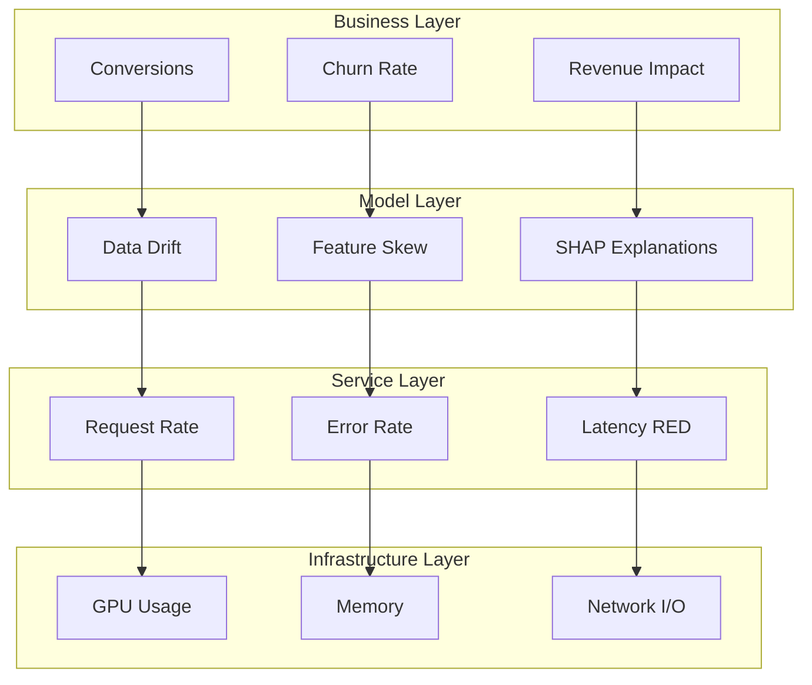
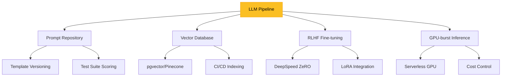

## Why "Scalable" MLOps Is Hard

> The most expensive model is the one nobody trusts or uses.

Large organisations juggle **petabyte-scale data**, **multiple clouds / on-prem regions**, and **tight regulatory controls**. The usual pain points:

- **Shadow pipelines** grow from exploratory notebooks and collapse under production load.
- **Hand-rolled bash scripts** lack versioning, rollback and auditability.
- **DevOps ≠ MLOps** — traditional CI/CD handles code, not evolving data or model artefacts.
- **Cross-functional friction** between data scientists, platform engineers, security and legal.

A robust MLOps solution must therefore deliver **repeatability → velocity → trust**.

---

## Six Architectural Pillars



### Data & Feature Management

1. **Data Versioning** – Tools such as [lakeFS](https://lakefs.io/) and [Delta Lake](https://docs.delta.io/) apply **Git-like semantics** to object stores so every training job can retrieve the exact snapshot it was built on.
2. **Central Feature Store** – [Feast](https://github.com/feast-dev/feast) or managed options like _Tecton_ cache **validated, low-latency** features, powering _both_ offline training and online serving.

```python
# Registering a feature set with Feast
from feast import FeatureStore, Entity, FeatureView, Field
from feast.types import Float32, Int64

customer = Entity(name="customer_id", join_keys=["customer_id"])

churn_view = FeatureView(
    name="customer_churn",
    entities=[customer],
    ttl=86400,
    schema=[
        Field(name="churn_score", dtype=Float32),
        Field(name="total_orders_30d", dtype=Int64),
    ],
    online=True,
)

store = FeatureStore(repo_path=".")
store.apply([customer, churn_view])
```

### Experimentation & Reproducibility

- **[MLflow Tracking](https://mlflow.org/)**: stores code + data + params + metrics → effortless lineage.
- **[Kubeflow Pipelines](https://www.kubeflow.org/docs/components/pipelines/)**: convert notebook logic into **idempotent container DAGs** across any Kubernetes cluster.

> _Treat the notebook as a design document; the pipeline is the executable contract._

### CI/CD for Machine Learning

Goal: **commit → test → train → validate → deploy** with zero manual clicks.



```yaml
# .github/workflows/mlops.yml – minimal GitHub Actions template
name: ci-cd-ml
on:
  push: { branches: [main] }

jobs:
  build-train:
    runs-on: ubuntu-latest
    steps:
    - uses: actions/checkout@v4
    - uses: iterative/setup-cml@v2       # CML for experiment reports
    - uses: azure/login@v2
      with: { creds: ${{ secrets.AZURE_CREDENTIALS }} }
    - name: Train & Register
      run: |
        az ml job create --file pipeline.yml
        az ml model list -o table
```

### Model Serving & Deployment

1. **Containerise everything** (OCI images via [BuildKit](https://github.com/moby/buildkit)).
2. **Serve** with [Seldon Core](https://github.com/SeldonIO/seldon-core) or [KFServing](https://github.com/kubeflow/kfserving) for **autoscaling, A/B testing, traffic shadowing**.
3. **Progressive rollout** (blue-green or canary) with instant rollback using model registry stage tags.

### Monitoring & Observability

- **Data & Concept Drift** – [Evidently AI](https://www.evidentlyai.com/) or [WhyLabs](https://whylabs.ai/) create drift profiles and send alerts before KPIs tank.
- **Model-specific metrics** – latency, resource usage, prediction-volume anomalies.
- **Cost & carbon dashboards** – increasingly required by EU digital-sustainability directives.

### Governance, Security & Compliance

A "trust layer" embedded in every step.

| Checkpoint   | Automated Gate                       | Common Tools                                                   |
| ------------ | ------------------------------------ | -------------------------------------------------------------- |
| Data ingress | PII scanner → quarantine             | lakeFS hooks, AWS Macie, BigQuery DLP                          |
| Pre-deploy   | Responsible-AI checklist & bias test | TFX Evaluator, Fairlearn                                       |
| Runtime      | Policy-as-code enforcement           | [Open Policy Agent](https://www.openpolicyagent.org/), Kyverno |

---

## Reference Blueprint


Each block is **loosely coupled via APIs** but **strongly governed via contracts** (OpenAPI, OpenLineage). The blueprint supports:

- **Multi-cloud** (AWS / Azure / GCP) and **hybrid on-prem** deployments.
- **Air-gapped clusters** for healthcare & finance.
- **Edge nodes** for low-latency inference.

---

## Choosing Your Toolchain

| Capability                 | OSS / Cloud-native     | Managed / SaaS      | Why It Matters                        |
| -------------------------- | ---------------------- | ------------------- | ------------------------------------- |
| **Data versioning**        | lakeFS, Delta Lake     | Databricks DLT      | Reproducible datasets                 |
| **Feature store**          | Feast, Hopsworks       | Tecton, Qwak        | Single source of feature truth        |
| **Experiment tracking**    | MLflow                 | Weights & Biases    | Rapid hypothesis iteration            |
| **Pipeline orchestration** | Kubeflow               | Vertex AI Pipelines | Scalable DAG execution                |
| **Serving**                | KFServing, Seldon Core | BentoML, SageMaker  | Autoscaling & canary releases         |
| **Monitoring**             | Evidently, WhyLabs     | Arize, Superwise    | SLA adherence & early drift detection |
| **IaC**                    | Terraform, Pulumi      | AWS Service Catalog | Environment parity & audit trails     |

> **Tip —** Pick **one** foundation cloud and **one** orchestration layer first; resist tool sprawl until you have a production win.

---

## End-to-End Implementation Walk-Through

### Provision the Platform with Terraform

```hcl
module "mlops_stack" {
  source  = "git::https://github.com/aws-samples/aws-mlops-pipelines-terraform"
  region  = "us-east-1"
  profile = "enterprise-prod"
}
```

_Provisioning output_: EKS cluster, GPU node-groups, S3 buckets, KMS keys, IAM roles, Secrets Manager.

### Define Reusable Pipeline Components

`components/` folder (Dockerfiles + Python):

- **data_ingest** → Spark job (EMR / Dataproc).
- **feature_engineering** → pandas → write to Feast.
- **train_model** → XGBoost / PyTorch Lightning script.
- **evaluate** → Evidently drift & bias reports.
- **register** → MLflow REST call.

Compose them in `kubeflow_pipeline.py`:



Run once to compile a YAML manifested DAG, then trigger via CI on every merge.

### Automate Experiments & Peer Review

1. **Pull Request** → automated CML bot comments with metrics & plots.
2. **Domain expert** reviews fairness metrics (demographic parity, equalised odds).
3. **Approval** merges PR → GitHub Actions kicks **training pipeline** and **model-registry promotion**.

### Safe Deployment Pattern



If P95 latency or business metrics degrade > 1 σ, rollback triggers automatically via Argo Rollouts.

---

## Monitoring, Observability & Governance

### Multi-Layer Observability



### Data & Concept Drift Detection

```python
from evidently.report import Report
from evidently.metric_preset import DataDriftPreset

report = Report(metrics=[DataDriftPreset()])
report.run(reference_data=ref_df, current_data=curr_df)
report.save_html("drift_report.html")
```

Serve `drift_report.html` behind an internal dashboard so product owners can review daily.

### Policy-as-Code Example (OPA)

```rego
package mlops.deployment

default allow = false

allow {
  input.stage == "production"
  not blacklist[input.model_id]
  input.bias_score < 0.05
}
```

_Deployment blocked_ if bias score exceeds threshold or the model ID is on a blacklist.

---

## LLMOps: Extending the Blueprint

Large-language models add **prompt + embedding versioning**, **vector-database indexing**, and **human feedback loops**:



1. **Prompt repositories** – store prompts & templates as code with test-suite scoring (BLEU, GPT-eval).
2. **Vector DB** – [pgvector](https://github.com/pgvector/pgvector) or [Pinecone](https://www.pinecone.io/) indexed via CI.
3. **RLHF fine-tuning schedules** – integrate _DeepSpeed ZeRO_ or _LoRA_ with Kubeflow.
4. **GPU-burst inference** – leverage serverless GPU grids (AWS Fargate GP, Lambda GPU) for cost control.

> **Pro-tip**: do _not_ bolt LLMOps on later; design unified artefact tracking from day 1.

---

## 2025-2027 Trends to Watch

| Trend                               | Why It Matters                                               |
| ----------------------------------- | ------------------------------------------------------------ |
| **AI supply-chain security (SBOM)** | U.S. executive order (2025) mandates SBOMs for ML artefacts. |
| **Green-ML cost dashboards**        | EU directive requires annual energy & CO₂ reporting.         |
| **Serverless GPU grids**            | 5 × cheaper for bursty inference workloads.                  |
| **Policy-as-code for AI safety**    | Insurance premiums linked to automated policy checks.        |
| **Multi-tenant feature platforms**  | Centralised features across business units accelerate reuse. |

---

## Curated Video Playlist

<iframe src="https://youtu.be/1jvxxa7tdjw" title=""Exploring MLOps & LLMOps Architectures"" frameborder="0"></iframe>

<iframe src="https://youtu.be/rKfknA48FGk" title="Kubeflow Pipeline End-to-End Workflow" frameborder="0"></iframe>

<iframe src="https://youtu.be/xGzkqSKy4IU" title="Wanted: A Silver-Bullet MLOps Solution (Roche)" frameborder="0"></iframe>

---

## Take-Away Checklist

- [x] **Version everything** — data, code, models, configs, prompts.
- [x] **Automate** end-to-end using CI/CD & IaC.
- [x] **Monitor** data, model and business metrics continuously.
- [x] **Govern** with policy-as-code and role-based access.
- [x] **Scale** elastically via Kubernetes or serverless GPU.
- [x] **Extend** your pipeline for LLMOps today.

> MLOps is not a tooling problem; it's a cultural contract to treat ML as a first-class software artefact.

**Ready to start?** Fork the Terraform module above, wire in your secrets, and ship your first _governed_ model to production this week—your compliance team (and future self) will thank you.
