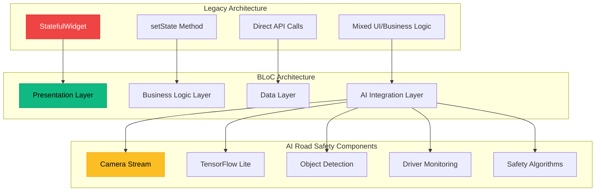

> **"The most intelligent app is the one that adapts to user behavior and prevents accidents before they happen."**

Mobile applications are increasingly becoming the frontline of road safety technology. With **90% of road accidents caused by human error** and the rise of AI-powered safety solutions, developers face the challenge of building **scalable, maintainable, and intelligent** Flutter applications that can process real-time data streams effectively.

The common pain points when building road safety apps include:

- **Legacy state management** that breaks under real-time AI processing loads
- **Tightly coupled UI and business logic** making testing and maintenance difficult  
- **Inconsistent data flow** between camera feeds, AI models, and UI updates
- **Performance bottlenecks** when handling multiple concurrent AI inference tasks
- **Poor separation of concerns** between detection logic, safety algorithms, and presentation

A robust Flutter architecture with BLoC pattern integration must therefore deliver **predictability → scalability → safety**.

---

## Why BLoC Pattern for AI Road Safety Apps?

BLoC (Business Logic Component) pattern provides the perfect foundation for AI-integrated road safety applications because it:

1. **Separates concerns** - UI remains focused on presentation while BLoC handles complex AI processing
2. **Manages streams effectively** - Essential for real-time camera feeds and AI inference results
3. **Provides testability** - Critical for safety-critical applications requiring extensive testing
4. **Enables state predictability** - Crucial when lives depend on consistent app behavior
5. **Supports reactive programming** - Perfect for handling multiple concurrent AI detection streams

The architecture enables developers to build applications that can simultaneously process **driver behavior detection**, **object recognition**, **collision prediction**, and **emergency response** while maintaining clean, maintainable code.

---

## Migration Architecture Overview



### Core Migration Layers

Based on the [official BLoC architecture](https://bloclibrary.dev/architecture/), we organize our road safety app into four distinct layers:

1. **Presentation Layer** – Flutter widgets and UI components
2. **Business Logic Layer** – BLoC classes handling safety logic and AI coordination
3. **Data Layer** – Repository pattern for sensor data and API communication
4. **AI Integration Layer** – TensorFlow Lite models and inference engines

---

## Step-by-Step Migration Guide

### Step 1: Dependencies and Setup

First, add the necessary dependencies to your `pubspec.yaml`:

```yaml
dependencies:
  flutter:
    sdk: flutter
  
  # BLoC State Management
  flutter_bloc: ^8.1.6
  bloc: ^8.1.4
  
  # AI and Camera
  tflite_flutter: ^0.10.4
  camera: ^0.10.5
  
  # Additional utilities
  equatable: ^2.0.5
  get_it: ^7.6.4
  
  # Road Safety specific
  sensors_plus: ^4.0.2
  geolocator: ^10.1.0
  
flutter:
  assets:
    - assets/models/
    - assets/labels/
```

### Step 2: Define Road Safety Events

Create comprehensive event classes for your road safety BLoC according to the [step-by-step BLoC implementation guide](https://medium.com/@ravipatel84184/flutters-bloc-pattern-for-state-management-a-step-by-step-guide-602d190fa369):

```dart
// events/road_safety_events.dart
abstract class RoadSafetyEvent extends Equatable {
  const RoadSafetyEvent();
  
  @override
  List<Object> get props => [];
}

class StartMonitoringEvent extends RoadSafetyEvent {}

class StopMonitoringEvent extends RoadSafetyEvent {}

class ProcessCameraFrameEvent extends RoadSafetyEvent {
  final CameraImage image;
  final DateTime timestamp;
  
  const ProcessCameraFrameEvent(this.image, this.timestamp);
  
  @override
  List<Object> get props => [image, timestamp];
}

class DetectionResultEvent extends RoadSafetyEvent {
  final List<DetectedObject> objects;
  final DriverState driverState;
  final double riskScore;
  
  const DetectionResultEvent(this.objects, this.driverState, this.riskScore);
  
  @override
  List<Object> get props => [objects, driverState, riskScore];
}

class EmergencyDetectedEvent extends RoadSafetyEvent {
  final EmergencyType type;
  final double confidence;
  final DateTime timestamp;
  
  const EmergencyDetectedEvent(this.type, this.confidence, this.timestamp);
  
  @override
  List<Object> get props => [type, confidence, timestamp];
}
```

### Step 3: Define Safety States

Create comprehensive state classes that represent all possible safety conditions:

```dart
// states/road_safety_states.dart
abstract class RoadSafetyState extends Equatable {
  const RoadSafetyState();
  
  @override
  List<Object> get props => [];
}

class RoadSafetyInitial extends RoadSafetyState {}

class RoadSafetyLoading extends RoadSafetyState {}

class RoadSafetyMonitoring extends RoadSafetyState {
  final List<DetectedObject> detectedObjects;
  final DriverState driverState;
  final double riskScore;
  final SafetyAlert? currentAlert;
  
  const RoadSafetyMonitoring({
    required this.detectedObjects,
    required this.driverState,
    required this.riskScore,
    this.currentAlert,
  });
  
  @override
  List<Object> get props => [detectedObjects, driverState, riskScore];
}

class RoadSafetyEmergency extends RoadSafetyState {
  final EmergencyType type;
  final String message;
  final List<String> recommendedActions;
  final DateTime timestamp;
  
  const RoadSafetyEmergency({
    required this.type,
    required this.message,
    required this.recommendedActions,
    required this.timestamp,
  });
  
  @override
  List<Object> get props => [type, message, recommendedActions, timestamp];
}

class RoadSafetyError extends RoadSafetyState {
  final String error;
  
  const RoadSafetyError(this.error);
  
  @override
  List<Object> get props => [error];
}
```

### Step 4: Create the Data Layer

Implement the repository pattern following [BLoC architecture principles](https://bloclibrary.dev/architecture/):

```dart
// repositories/road_safety_repository.dart
class RoadSafetyRepository {
  final AIInferenceProvider _aiProvider;
  final CameraProvider _cameraProvider;
  final SensorProvider _sensorProvider;
  
  RoadSafetyRepository({
    required AIInferenceProvider aiProvider,
    required CameraProvider cameraProvider,
    required SensorProvider sensorProvider,
  }) : _aiProvider = aiProvider,
       _cameraProvider = cameraProvider,
       _sensorProvider = sensorProvider;
  
  Stream<CameraImage> get cameraStream => _cameraProvider.imageStream;
  
  Stream<SensorData> get sensorStream => _sensorProvider.dataStream;
  
  Future<List<DetectedObject>> detectObjects(CameraImage image) async {
    return await _aiProvider.runObjectDetection(image);
  }
  
  Future<DriverState> analyzeDriverBehavior(CameraImage image, SensorData sensors) async {
    return await _aiProvider.analyzeDriverBehavior(image, sensors);
  }
  
  Future<double> calculateRiskScore(
    List<DetectedObject> objects,
    DriverState driverState,
    SensorData sensors,
  ) async {
    return await _aiProvider.calculateRiskScore(objects, driverState, sensors);
  }
}
```

### Step 5: Implement AI Integration Layer

Create the AI provider that handles TensorFlow Lite integration based on [real-time object detection patterns](https://www.dhiwise.com/post/implementing-flutter-real-time-object-detection-with-tensorflow-lite):

```dart
// providers/ai_inference_provider.dart
class AIInferenceProvider {
  late Interpreter _objectDetectionInterpreter;
  late Interpreter _driverMonitoringInterpreter;
  
  static const String _objectDetectionModel = 'assets/models/road_objects.tflite';
  static const String _driverMonitoringModel = 'assets/models/driver_monitoring.tflite';
  
  Future<void> initialize() async {
    _objectDetectionInterpreter = await Interpreter.fromAsset(_objectDetectionModel);
    _driverMonitoringInterpreter = await Interpreter.fromAsset(_driverMonitoringModel);
  }
  
  Future<List<DetectedObject>> runObjectDetection(CameraImage image) async {
    // Preprocess image
    final input = _preprocessImage(image);
    
    // Run inference
    final output = List.filled(1 * 10 * 4, 0.0).reshape([1, 10, 4]);
    _objectDetectionInterpreter.run(input, output);
    
    // Post-process results
    return _postprocessObjectDetection(output);
  }
  
  Future<DriverState> analyzeDriverBehavior(CameraImage image, SensorData sensors) async {
    final input = _preprocessDriverImage(image);
    final output = List.filled(1 * 5, 0.0).reshape([1, 5]);
    
    _driverMonitoringInterpreter.run(input, output);
    
    return _interpretDriverState(output, sensors);
  }
  
  Future<double> calculateRiskScore(
    List<DetectedObject> objects,
    DriverState driverState,
    SensorData sensors,
  ) async {
    // Implement risk calculation algorithm
    double riskScore = 0.0;
    
    // Factor in detected objects
    for (final object in objects) {
      riskScore += _calculateObjectRisk(object);
    }
    
    // Factor in driver state
    riskScore += _calculateDriverRisk(driverState);
    
    // Factor in sensor data
    riskScore += _calculateSensorRisk(sensors);
    
    return riskScore.clamp(0.0, 1.0);
  }
  
  List<double> _preprocessImage(CameraImage image) {
    // Convert YUV420 to RGB and normalize
    final rgbImage = _convertYUV420ToRGB(image);
    return _normalizeImage(rgbImage);
  }
  
  // Additional helper methods...
}
```

### Step 6: Create the Road Safety BLoC

Implement the main BLoC following the [modern on<Event> pattern](https://bloclibrary.dev/migration/):

```dart
// blocs/road_safety_bloc.dart
class RoadSafetyBloc extends Bloc<RoadSafetyEvent, RoadSafetyState> {
  final RoadSafetyRepository _repository;
  StreamSubscription<CameraImage>? _cameraSubscription;
  StreamSubscription<SensorData>? _sensorSubscription;
  
  RoadSafetyBloc({
    required RoadSafetyRepository repository,
  }) : _repository = repository,
       super(RoadSafetyInitial()) {
    
    on<StartMonitoringEvent>(_onStartMonitoring);
    on<StopMonitoringEvent>(_onStopMonitoring);
    on<ProcessCameraFrameEvent>(_onProcessCameraFrame);
    on<DetectionResultEvent>(_onDetectionResult);
    on<EmergencyDetectedEvent>(_onEmergencyDetected);
  }
  
  Future<void> _onStartMonitoring(
    StartMonitoringEvent event,
    Emitter<RoadSafetyState> emit,
  ) async {
    emit(RoadSafetyLoading());
    
    try {
      // Start camera and sensor streams
      _cameraSubscription = _repository.cameraStream.listen((image) {
        add(ProcessCameraFrameEvent(image, DateTime.now()));
      });
      
      _sensorSubscription = _repository.sensorStream.listen((sensors) {
        // Handle sensor data
      });
      
      emit(const RoadSafetyMonitoring(
        detectedObjects: [],
        driverState: DriverState.attentive,
        riskScore: 0.0,
      ));
    } catch (error) {
      emit(RoadSafetyError(error.toString()));
    }
  }
  
  Future<void> _onProcessCameraFrame(
    ProcessCameraFrameEvent event,
    Emitter<RoadSafetyState> emit,
  ) async {
    try {
      // Run AI inference
      final objects = await _repository.detectObjects(event.image);
      final driverState = await _repository.analyzeDriverBehavior(event.image, SensorData.current);
      final riskScore = await _repository.calculateRiskScore(objects, driverState, SensorData.current);
      
      // Check for emergency conditions
      if (riskScore > 0.8) {
        add(EmergencyDetectedEvent(EmergencyType.collisionRisk, riskScore, event.timestamp));
      } else {
        add(DetectionResultEvent(objects, driverState, riskScore));
      }
    } catch (error) {
      emit(RoadSafetyError(error.toString()));
    }
  }
  
  Future<void> _onDetectionResult(
    DetectionResultEvent event,
    Emitter<RoadSafetyState> emit,
  ) async {
    if (state is RoadSafetyMonitoring) {
      final currentState = state as RoadSafetyMonitoring;
      
      emit(RoadSafetyMonitoring(
        detectedObjects: event.objects,
        driverState: event.driverState,
        riskScore: event.riskScore,
        currentAlert: _generateAlert(event.objects, event.driverState, event.riskScore),
      ));
    }
  }
  
  Future<void> _onEmergencyDetected(
    EmergencyDetectedEvent event,
    Emitter<RoadSafetyState> emit,
  ) async {
    emit(RoadSafetyEmergency(
      type: event.type,
      message: _getEmergencyMessage(event.type),
      recommendedActions: _getRecommendedActions(event.type),
      timestamp: event.timestamp,
    ));
  }
  
  @override
  Future<void> close() {
    _cameraSubscription?.cancel();
    _sensorSubscription?.cancel();
    return super.close();
  }
}
```

### Step 7: Connect BLoC with UI

Create the presentation layer that consumes BLoC states:

```dart
// pages/road_safety_page.dart
class RoadSafetyPage extends StatelessWidget {
  @override
  Widget build(BuildContext context) {
    return BlocProvider(
      create: (context) => RoadSafetyBloc(
        repository: GetIt.instance<RoadSafetyRepository>(),
      ),
      child: const RoadSafetyView(),
    );
  }
}

class RoadSafetyView extends StatelessWidget {
  const RoadSafetyView({Key? key}) : super(key: key);
  
  @override
  Widget build(BuildContext context) {
    return Scaffold(
      body: BlocConsumer<RoadSafetyBloc, RoadSafetyState>(
        listener: (context, state) {
          if (state is RoadSafetyEmergency) {
            _showEmergencyDialog(context, state);
          }
        },
        builder: (context, state) {
          return Stack(
            children: [
              // Camera preview
              const CameraPreview(),
              
              // Overlay with detection results
              if (state is RoadSafetyMonitoring) ...[
                DetectionOverlay(
                  detectedObjects: state.detectedObjects,
                  driverState: state.driverState,
                  riskScore: state.riskScore,
                ),
                
                // Risk score indicator
                Positioned(
                  top: 50,
                  right: 20,
                  child: RiskScoreIndicator(score: state.riskScore),
                ),
                
                // Safety controls
                Positioned(
                  bottom: 50,
                  left: 20,
                  right: 20,
                  child: SafetyControls(
                    onStartMonitoring: () => context.read<RoadSafetyBloc>().add(StartMonitoringEvent()),
                    onStopMonitoring: () => context.read<RoadSafetyBloc>().add(StopMonitoringEvent()),
                    isMonitoring: true,
                  ),
                ),
              ],
              
              if (state is RoadSafetyLoading)
                const Center(child: CircularProgressIndicator()),
              
              if (state is RoadSafetyError)
                Center(child: Text('Error: ${state.error}')),
            ],
          );
        },
      ),
    );
  }
  
  void _showEmergencyDialog(BuildContext context, RoadSafetyEmergency state) {
    showDialog(
      context: context,
      barrierDismissible: false,
      builder: (context) => AlertDialog(
        title: Text('⚠️ ${state.type.displayName}'),
        content: Column(
          mainAxisSize: MainAxisSize.min,
          crossAxisAlignment: CrossAxisAlignment.start,
          children: [
            Text(state.message),
            const SizedBox(height: 16),
            const Text('Recommended Actions:', style: TextStyle(fontWeight: FontWeight.bold)),
            ...state.recommendedActions.map((action) => Text('• $action')),
          ],
        ),
        actions: [
          TextButton(
            onPressed: () {
              Navigator.of(context).pop();
              context.read<RoadSafetyBloc>().add(StartMonitoringEvent());
            },
            child: const Text('Resume Monitoring'),
          ),
        ],
      ),
    );
  }
}
```

---

## Advanced AI Integration Patterns

### Real-Time Stream Processing

For optimal performance in road safety applications, implement stream-based AI processing:

```dart
class StreamAIProcessor {
  final StreamController<CameraImage> _inputController = StreamController<CameraImage>();
  final StreamController<AIResult> _outputController = StreamController<AIResult>();
  
  Stream<AIResult> get results => _outputController.stream;
  
  void initialize() {
    _inputController.stream
        .bufferTime(const Duration(milliseconds: 100))
        .where((frames) => frames.isNotEmpty)
        .map((frames) => frames.last) // Take latest frame
        .asyncMap((frame) => _processFrame(frame))
        .listen(_outputController.add);
  }
  
  Future<AIResult> _processFrame(CameraImage frame) async {
    // Parallel processing for multiple AI models
    final results = await Future.wait([
      _runObjectDetection(frame),
      _runDriverMonitoring(frame),
      _runLaneDetection(frame),
    ]);
    
    return AIResult(
      objects: results[0] as List<DetectedObject>,
      driverState: results[1] as DriverState,
      lanes: results[2] as List<Lane>,
    );
  }
}
```

### Multi-Model Coordination

Coordinate multiple AI models for comprehensive road safety:

```dart
class RoadSafetyAICoordinator {
  final Map<String, Interpreter> _models = {};
  
  Future<void> loadModels() async {
    _models['objects'] = await Interpreter.fromAsset('assets/models/yolo_road_objects.tflite');
    _models['driver'] = await Interpreter.fromAsset('assets/models/driver_monitoring.tflite');
    _models['lanes'] = await Interpreter.fromAsset('assets/models/lane_detection.tflite');
    _models['signs'] = await Interpreter.fromAsset('assets/models/traffic_signs.tflite');
  }
  
  Future<ComprehensiveAnalysis> analyzeScene(CameraImage frame) async {
    final futures = <Future>[];
    
    // Run all models concurrently
    futures.add(_detectObjects(frame));
    futures.add(_monitorDriver(frame));
    futures.add(_detectLanes(frame));
    futures.add(_recognizeTrafficSigns(frame));
    
    final results = await Future.wait(futures);
    
    return ComprehensiveAnalysis(
      objects: results[0] as List<DetectedObject>,
      driverState: results[1] as DriverState,
      lanes: results[2] as List<Lane>,
      trafficSigns: results[3] as List<TrafficSign>,
      riskAssessment: _calculateComprehensiveRisk(results),
    );
  }
}
```

---

## Testing Your BLoC Road Safety App

### Unit Testing BLoC Logic

```dart
// test/blocs/road_safety_bloc_test.dart
void main() {
  group('RoadSafetyBloc', () {
    late RoadSafetyBloc roadSafetyBloc;
    late MockRoadSafetyRepository mockRepository;
    
    setUp(() {
      mockRepository = MockRoadSafetyRepository();
      roadSafetyBloc = RoadSafetyBloc(repository: mockRepository);
    });
    
    tearDown(() {
      roadSafetyBloc.close();
    });
    
    blocTest<RoadSafetyBloc, RoadSafetyState>(
      'emits [RoadSafetyLoading, RoadSafetyMonitoring] when StartMonitoringEvent is added',
      build: () {
        when(() => mockRepository.cameraStream).thenAnswer(
          (_) => Stream.fromIterable([mockCameraImage]),
        );
        return roadSafetyBloc;
      },
      act: (bloc) => bloc.add(StartMonitoringEvent()),
      expect: () => [
        RoadSafetyLoading(),
        const RoadSafetyMonitoring(
          detectedObjects: [],
          driverState: DriverState.attentive,
          riskScore: 0.0,
        ),
      ],
    );
    
    blocTest<RoadSafetyBloc, RoadSafetyState>(
      'emits RoadSafetyEmergency when high risk is detected',
      build: () {
        when(() => mockRepository.detectObjects(any())).thenAnswer(
          (_) async => [DetectedObject(type: 'vehicle', confidence: 0.95, distance: 5.0)],
        );
        when(() => mockRepository.calculateRiskScore(any(), any(), any())).thenAnswer(
          (_) async => 0.9,
        );
        return roadSafetyBloc;
      },
      act: (bloc) => bloc.add(ProcessCameraFrameEvent(mockCameraImage, DateTime.now())),
      expect: () => [
        isA<RoadSafetyEmergency>(),
      ],
    );
  });
}
```

### Integration Testing AI Components

```dart
// test/integration/ai_integration_test.dart
void main() {
  group('AI Integration Tests', () {
    late AIInferenceProvider aiProvider;
    
    setUpAll(() async {
      aiProvider = AIInferenceProvider();
      await aiProvider.initialize();
    });
    
    testWidgets('AI models process camera frames without crashing', (tester) async {
      final testImage = await _createTestCameraImage();
      
      expect(
        () async => await aiProvider.runObjectDetection(testImage),
        returnsNormally,
      );
      
      expect(
        () async => await aiProvider.analyzeDriverBehavior(testImage, SensorData.mock()),
        returnsNormally,
      );
    });
    
    testWidgets('Risk calculation produces valid scores', (tester) async {
      final objects = [DetectedObject(type: 'vehicle', confidence: 0.8, distance: 10.0)];
      final driverState = DriverState.distracted;
      final sensors = SensorData.mock();
      
      final riskScore = await aiProvider.calculateRiskScore(objects, driverState, sensors);
      
      expect(riskScore, greaterThanOrEqualTo(0.0));
      expect(riskScore, lessThanOrEqualTo(1.0));
    });
  });
}
```

---

## Performance Optimization for Real-Time AI

### Memory Management

```dart
class OptimizedAIProcessor {
  final int _maxFrameBuffer = 3;
  final Queue<CameraImage> _frameBuffer = Queue<CameraImage>();
  
  void processFrame(CameraImage frame) {
    // Maintain frame buffer size
    if (_frameBuffer.length >= _maxFrameBuffer) {
      _frameBuffer.removeFirst();
    }
    
    _frameBuffer.add(frame);
    
    // Process only if we have enough frames
    if (_frameBuffer.length == _maxFrameBuffer) {
      _processFrameBuffer();
    }
  }
  
  void _processFrameBuffer() {
    // Use temporal information from multiple frames
    final results = _frameBuffer.map((frame) => _quickInference(frame)).toList();
    final stabilizedResult = _stabilizeResults(results);
    
    _outputController.add(stabilizedResult);
  }
}
```

### GPU Acceleration

```dart
class GPUAcceleratedInference {
  late GpuDelegate _gpuDelegate;
  
  Future<void> initialize() async {
    _gpuDelegate = GpuDelegate(
      options: GpuDelegateOptions(
        allowPrecisionLoss: true,
        waitType: TfLiteGpuDelegateWaitType.active,
      ),
    );
    
    final interpreterOptions = InterpreterOptions()
      ..addDelegate(_gpuDelegate);
    
    _interpreter = await Interpreter.fromAsset(
      'assets/models/optimized_road_safety.tflite',
      options: interpreterOptions,
    );
  }
}
```

---

## Deployment and Monitoring

### Production-Ready Configuration

```dart
class ProductionConfig {
  static const bool enableDetailedLogging = false;
  static const int maxConcurrentInferences = 2;
  static const double emergencyThreshold = 0.8;
  static const Duration processingTimeout = Duration(milliseconds: 100);
  
  static Map<String, dynamic> getModelConfig() {
    return {
      'object_detection': {
        'confidence_threshold': 0.6,
        'nms_threshold': 0.4,
        'max_detections': 20,
      },
      'driver_monitoring': {
        'drowsiness_threshold': 0.7,
        'distraction_threshold': 0.6,
        'head_pose_sensitivity': 0.8,
      },
      'risk_assessment': {
        'time_to_collision_weight': 0.4,
        'object_proximity_weight': 0.3,
        'driver_state_weight': 0.3,
      },
    };
  }
}
```

### Monitoring and Analytics

```dart
class RoadSafetyAnalytics {
  final FirebaseAnalytics _analytics = FirebaseAnalytics.instance;
  
  void logDetectionEvent(List<DetectedObject> objects, double riskScore) {
    _analytics.logEvent(
      name: 'object_detection',
      parameters: {
        'object_count': objects.length,
        'risk_score': riskScore,
        'timestamp': DateTime.now().millisecondsSinceEpoch,
      },
    );
  }
  
  void logEmergencyEvent(EmergencyType type, double confidence) {
    _analytics.logEvent(
      name: 'emergency_detected',
      parameters: {
        'emergency_type': type.name,
        'confidence': confidence,
        'timestamp': DateTime.now().millisecondsSinceEpoch,
      },
    );
  }
  
  void logPerformanceMetrics(Duration processingTime, double cpuUsage) {
    _analytics.logEvent(
      name: 'performance_metrics',
      parameters: {
        'processing_time_ms': processingTime.inMilliseconds,
        'cpu_usage_percent': cpuUsage,
        'timestamp': DateTime.now().millisecondsSinceEpoch,
      },
    );
  }
}
```

---

## 2025-2027 Road Safety AI Trends

| Trend | Impact on Flutter Development |
|-------|------------------------------|
| **Edge AI Acceleration** | Dedicated NPU chips will enable 10x faster on-device inference |
| **Federated Learning** | Privacy-preserving model updates without exposing user data |
| **Multi-modal Fusion** | Combining camera, radar, and lidar data for comprehensive safety |
| **Predictive Safety Analytics** | AI models that predict accidents seconds before they happen |
| **5G-Enabled Cooperative Safety** | Vehicle-to-vehicle communication for collective intelligence |

---

## Video Resources

<iframe width="560" height="315" src="https://www.youtube.com/embed/spU-oHBTd6o" title="Artificial Intelligence (AI) and Computer Vision for Road Safety" frameborder="0" allow="accelerometer; autoplay; clipboard-write; encrypted-media; gyroscope; picture-in-picture" allowfullscreen></iframe>

<iframe width="560" height="315" src="https://www.youtube.com/embed/kLPOXdHOrGo" title="Real-Time Face Detection App in Flutter - Live Camera with ML Kit" frameborder="0" allow="accelerometer; autoplay; clipboard-write; encrypted-media; gyroscope; picture-in-picture" allowfullscreen></iframe>

---

## Migration Checklist

- [x] **Add BLoC dependencies** to pubspec.yaml
- [x] **Define comprehensive events** for all safety scenarios
- [x] **Create predictable states** covering monitoring, emergency, and error conditions
- [x] **Implement repository pattern** for clean data layer separation
- [x] **Integrate AI models** with proper error handling and performance optimization
- [x] **Create BLoC with on<Event> handlers** following modern patterns
- [x] **Build responsive UI** with BlocBuilder and BlocListener
* [x] **Add comprehensive tests** for business logic, AI pipelines, and widget integration
* [x] **Automate CI/CD** with unit, integration, and performance suites running on every commit
* [x] **Instrument analytics & crash reporting** (Firebase Crashlytics, Sentry) for real-world feedback
* [x] **Field-test on-device** with staged roll-outs and live telemetry before public release

---

## Key Takeaways

1. **Predictability → Scalability → Safety**: A disciplined BLoC architecture turns real-time chaos (camera frames, sensor data, multiple AI models) into deterministic pipelines you can test, monitor, and trust.
2. **Streams Are Your Superpower**: Leveraging Dart streams lets you buffer, throttle, and parallelize AI inferences without locking up the UI thread or draining the battery.
3. **Separate Early, Sleep Better**: By isolating AI integration, safety algorithms, data repositories, and presentation, you gain the freedom to swap models, refactor logic, or redesign the UI—without destabilizing production builds.
4. **Testing Isn’t Optional**: Road-safety software is literally a life-critical domain. Treat every BLoC unit test, integration test, and performance benchmark as a seat belt for your codebase.
5. **Optimize, Then Optimize Again**: GPU delegates, frame buffering, and federated model updates keep latency down and user trust up as your feature set—and inference load—inevitably grow.

---

## What’s Next?

* **Prototype quickly** with the provided snippets—replace mock implementations with your own TensorFlow Lite or Core ML models.
* **Benchmark rigorously** on mid-range Android and iOS hardware; edge cases often surface only under thermal throttling.
* **Plan for over-the-air model updates** (TensorFlow Lite Model Maker, Firebase ML) so your safety algorithms improve continuously without forcing app-store updates.

---

> The difference between an app that **prevents** accidents and one that merely **records** them is measured in milliseconds of latency and lines of untested code.

### **Ready to build a road-safety app drivers actually trust?**

As a seasoned Flutter & AI consultant, I turn legacy, spaghetti-state codebases into production-ready BLoC architectures that **process live camera feeds, predict collisions, and surface alerts in under 100 ms**—all while staying maintainable for the long haul.

**What you get:**

* ✅ **Architecture audit** pinpointing your current performance and safety bottlenecks
* ✅ **Full migration plan** to a modular BLoC + repository setup (zero downtime)
* ✅ **On-device AI optimization** for GPU/NPU acceleration and battery efficiency
* ✅ **CI/CD pipelines & test harnesses** tailored to real-time computer-vision workloads
* ✅ **60-day post-launch support** to iron out edge cases in the wild

**Investment:** Engagements start at **\$12 K**—a fraction of the cost (and liability) of a single production crash.

[Book Your Free Safety Architecture Assessment](https://calendly.com/megham-garg/session)

*Don’t wait for an accident report to discover your app’s weaknesses. Let’s engineer safety—and user confidence—into every frame and every line of code today.*
